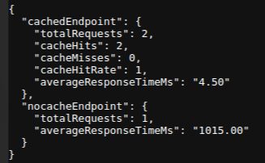

## Redis Concepts :

<p align="center">
   
</p>

<h1 align="center">
Redis
</h1>

### Installation of Redis in Ubuntu

```bash
sudo apt update
sudo apt install redis-server -y
```

Enable Redis to start automatically

Edit the redis config:
```bash
sudo nano /etc/redis/redis.conf
```

Change the following line 

change ```supervised no``` to ```supervised systemd```
Save and exit


Open Redis CLI
```bash
redis-cli
```

Test
```
127.0.0.1:6379> ping
PONG
```

[Official Installation Docs](https://redis.io/docs/latest/operate/oss_and_stack/install/archive/install-redis/)


The following repository contains the performance of api using redis . We generally see the response time of request with both caching and no-caching


## Installation Steps:

```bash
git clone https://github.com/uchiha-vivek/Redis-concepts.git
```

```bash
cd Redis-concepts
```

Install the dependencies
```bash
npm install
```

Run the file
```bash
node index.js
```


### How to test :

Once the server is running

Call cached endpoint (first time hit's miss)
```bash
curl "http://localhost:3000/photos?albumId=1"
```


call cached endpoint again(hits)
```bash
curl "http://localhost:3000/photos?albumId=1"
```

Invoke no-cache endpoint
```bash
curl "http://localhost:3000/photos-nocache?albumId=1"
```


Test and check the metrics:
```bash
curl "http://localhost:3000/metrics"

```


### Performance Metrics:

<p align="center">
   
</p>


### Data Structures in Redis

The following data structures have been included:
- List
- String
- Set
- Sorted Set
- Hash
- JSON

[Link of Data Structure](https://github.com/uchiha-vivek/Redis-concepts/blob/main/data-structures/structure.js)

Ways to test it

Navigate to ```data-structures``` folder
Run ```node structure.js```


Test the following below api's

List
```bash
http://localhost:3000/api/v1/list
```

String
```bash
http://localhost:3000/api/v1/string
```

Set
```bash
http://localhost:3000/api/v1/set
```

Sorted Set
```bash
http://localhost:3000/api/v1/zset
```

Hash
```bash
http://localhost:3000/api/v1/hash
```

JSON
```bash
http:/localhost:3000/api/v1/json
```


